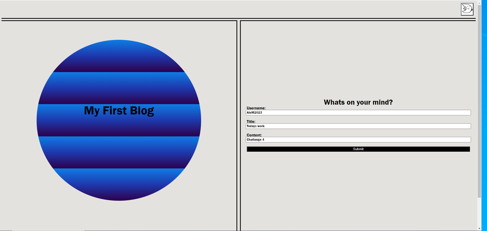
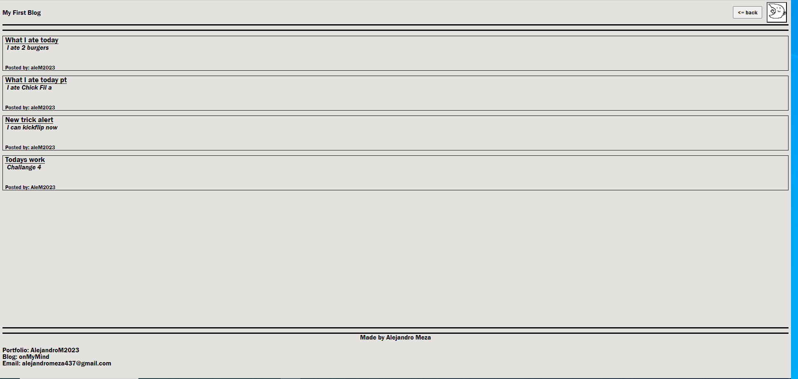

# Prework Study Guide Webpage

## Description
In this web application the user uses a username, title and content input box which have input validation to create a blog post. When the user clicks submit they are redericted to a blog page where all of their previous post are displayed dynamically. The user also has the option between selecting a light or a dark theme. The theme chosen will be applied until the user click on the theme button again even after closing the page and will apply to both pages. The user has the option to go back to the form page if they wish to add more posts

    home page

    blog page

link to github pages: https://alejandrom2023.github.io/Module3Challange/

## Installation

N/A

## Usage

By connecting to the page you can sees the fields to enter a username title and content for a post. User can also see all of their previous posts and change between dark and light them to pages.

## Credits

N/A

## License

The last section of a high-quality README file is the license. This lets other developers know what they can and cannot do with your project. If you need help choosing a license, refer to [https://choosealicense.com/](https://choosealicense.com/).

